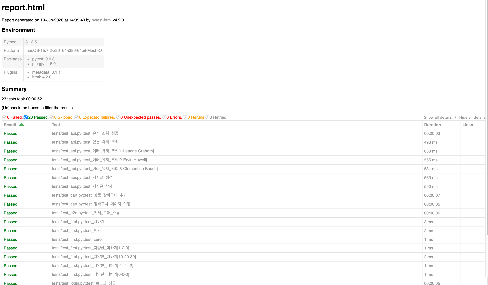

# QA 자동화 테스트 포트폴리오

## 프로젝트 소개
Playwright와 pytest를 활용한 웹 UI 자동화 및 API 테스트 프로젝트입니다.

## 🛠 사용 기술
- Python 3.13
- pytest
- Playwright
- requests
- GitHub Actions (CI/CD)

## 📁 프로젝트 구조
qa_automation/
├── pages/
│   ├── login_page.py
│   ├── inventory_page.py
│   └── checkout_page.py
└── tests/
├── test_first.py
├── test_login.py
├── test_cart.py
├── test_e2e.py
└── test_api.py

## 테스트 시나리오

### UI 자동화 (Playwright)
- 로그인 성공/실패/빈값 테스트
- 장바구니 추가 및 페이지 이동 테스트
- 전체 구매 흐름 E2E 테스트 (로그인 → 상품 선택 → 장바구니 → 결제 완료)

### API 자동화 (requests)
- 유저 조회 (정상/음수 케이스)
- 여러 유저 parametrize 테스트
- 게시글 생성 (POST)
- 게시글 삭제 (DELETE)

## 실행 방법
```bash
# 설치
pip3 install playwright pytest pytest-html requests python-dotenv
playwright install

# 전체 테스트 실행
pytest tests/ -v

# HTML 리포트 생성
pytest tests/ -v --html=report.html
```

## 📊 테스트 결과

